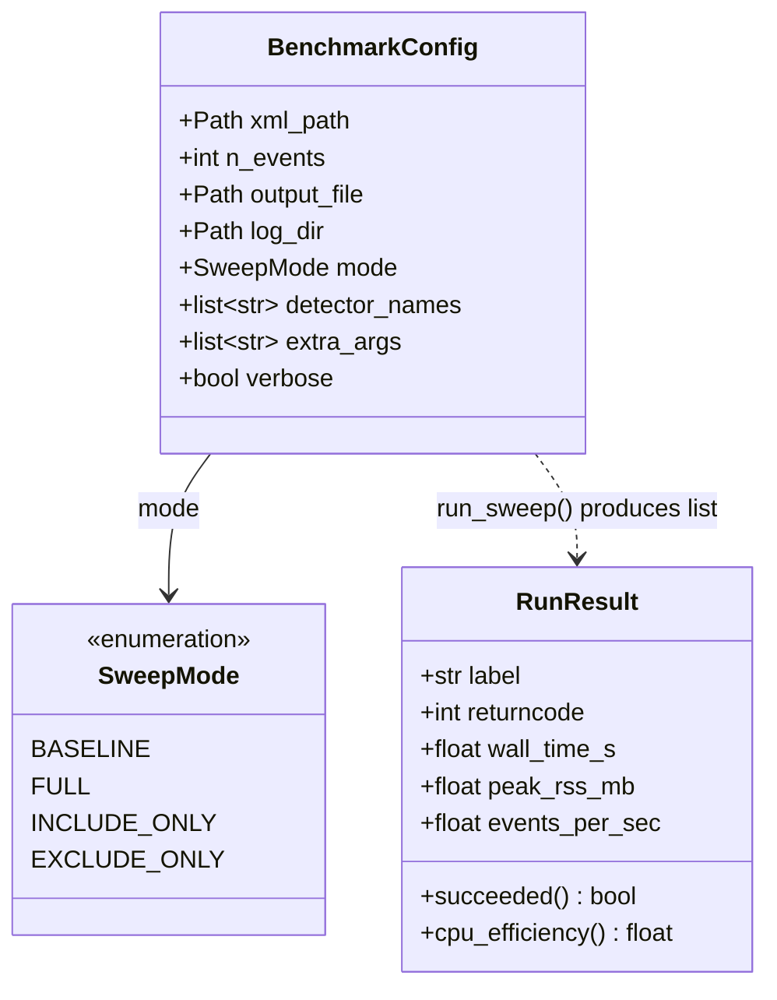
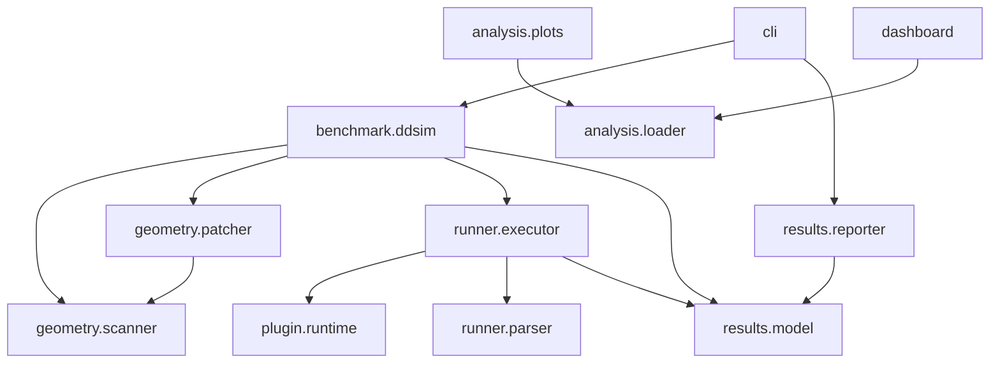

# Component diagrams

Class- and module-level structure. For the runtime sequence see
[Data flow](data-flow.md).

## Core domain model

- [`BenchmarkConfig`](../reference/api/benchmark/ddsim.md) is a dataclass that
  validates its invariants on construction (e.g. include-only needs a non-empty
  detector list; duplicates are de-duplicated).
- [`RunResult`](../reference/api/results/model.md) is plain data — optional
  metric fields (parsing can fail) plus a few derived properties.

The fields above are illustrative; the [API reference](../reference/api-reference.md)
has the authoritative, always-current signatures.

## Module dependencies

Notable properties:

- **No cycles**, dependencies point one way.
- **`analysis` is decoupled from execution** — it reads the output files and
  never imports the runner, so you can analyse results anywhere without Key4hep.
- **`plugin.runtime` is the only Python that knows about the C++ plugins**, and
  only by library filename and DDG4 `.components` manifest.

## See also

- [Architecture overview](overview.md) — the layered view and rationale.
- [Data flow](data-flow.md) — how these components interact at runtime.
