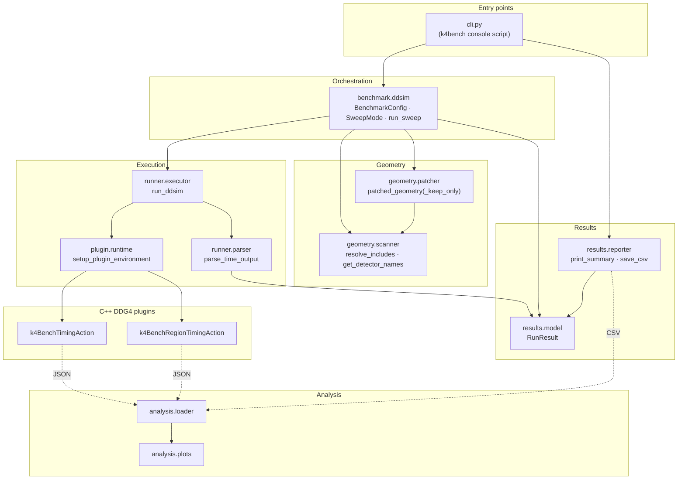
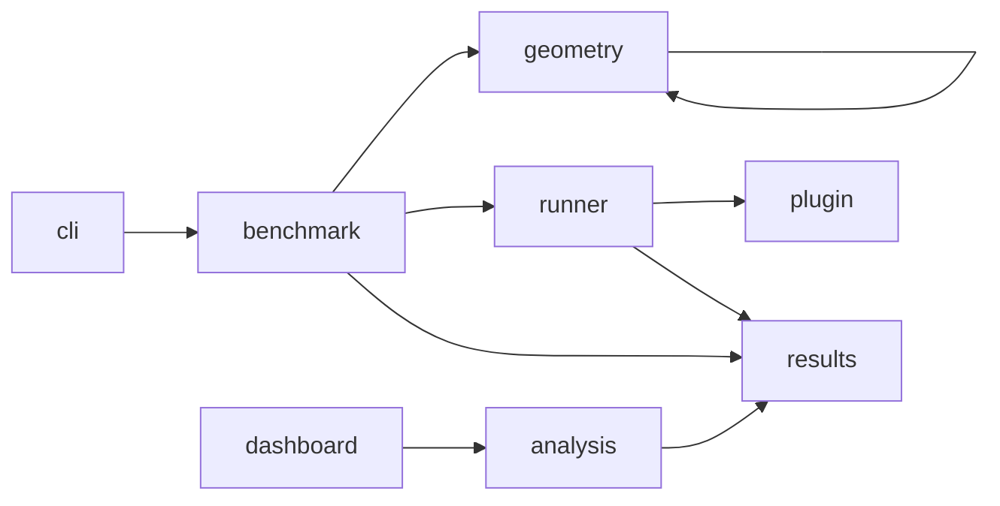

# Architecture overview

This section is for readers who want to understand *how k4Bench is built* — to
debug it, extend it, or evaluate it. It complements the
[user-guide overview](../user-guide/overview.md), which covers *how to use* it.

## Guiding principle: separate instrumentation from physics

The single most important design idea is a strict separation of concerns:

- **k4Bench owns instrumentation** — timing, logging, geometry manipulation,
  metrics extraction, result modelling.
- **The user owns physics** — particles, energies, inputs, steering — passed
  verbatim to `ddsim` via `--ddsim-args`.

The executor knows about exactly three `ddsim` flags (`--compactFile`,
`--numberOfEvents`, `--outputFile`) because it must inject those to do its job.
Everything else is opaque to it. This keeps k4Bench small, stable against
`ddsim` changes, and reusable for any DD4hep geometry (and, eventually, for
reconstruction).

## Component map

## Layers, top to bottom

| Layer | Modules | Responsibility |
| --- | --- | --- |
| **Entry** | `cli.py` | Parse args → `BenchmarkConfig`; orchestrate output (table, CSV, pickle); exit code |
| **Orchestration** | `benchmark.ddsim` | Choose a sweep strategy; loop over configurations; collect `RunResult`s |
| **Geometry** | `geometry.scanner`, `geometry.patcher` | Discover detectors; produce patched temp XML non-destructively |
| **Execution** | `runner.executor`, `runner.parser`, `plugin.runtime` | Run `ddsim` under `time -v`; load plugins; scrape metrics |
| **Native** | `plugin/*.cpp` | In-process per-event & per-detector instrumentation |
| **Results** | `results.model`, `results.reporter` | Typed metrics; human + machine output |
| **Analysis** | `analysis.loader`, `analysis.plots` | Load artifacts into pandas; Plotly figures |
| **Dashboard** | `dashboard/` | Historical, hosted view over EOS data |

Each is detailed in [Component diagrams](component-diagrams.md) and the runtime
interactions are in [Data flow](data-flow.md).

## Dependency direction

Dependencies point *downward* and never cycle:

- `analysis` depends only on the *artifacts* (CSV/JSON), not on the runner — you
  can analyse results on a laptop with no Key4hep.
- `dashboard` depends on `analysis` (it imports the loaders) but nothing imports
  the dashboard.
- The C++ plugins have no Python dependency; they're discovered at runtime by
  filename/`.components` manifest.

## Key data structures

- [`BenchmarkConfig`](../reference/api/benchmark/ddsim.md) — the immutable-ish
  description of a sweep (validated in `__post_init__`).
- [`SweepMode`](../reference/api/benchmark/ddsim.md) — the strategy enum.
- [`RunResult`](../reference/api/results/model.md) — one run's metrics, with
  computed properties (`succeeded`, `total_cpu_s`, `cpu_efficiency`).

See [Component diagrams](component-diagrams.md) for their class relationships.

## Where the boundaries are

- **Process boundary:** `ddsim` runs as a child process in its own session
  (process group), wrapped in `/usr/bin/time -v`. k4Bench communicates with it
  only through arguments, env vars, stdout, and the output file's size.
- **Language boundary:** the C++ plugins talk to Python only through env vars
  (input: where to write) and JSON files (output). There is no FFI.
- **Network boundary:** the core tool is offline; only CI (EOS upload) and the
  dashboard (WebEOS download) touch the network.

These boundaries are why k4Bench is robust: a plugin failure, a ddsim crash, or
a network hiccup degrades gracefully instead of taking down the run.

## Next

- [Component diagrams](component-diagrams.md) — class & module structure.
- [Data flow](data-flow.md) — sequence of a sweep and the CI→dashboard path.
