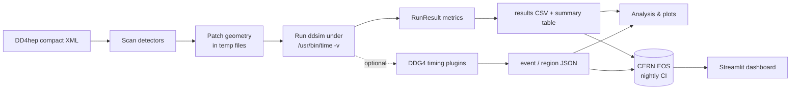

---
hide:
  - navigation
---

# k4Bench

**Detector-agnostic performance benchmarking for DD4hep / Geant4 (`ddsim`)
simulations in the [Key4hep](https://key4hep.github.io/key4hep-doc/) stack.**

k4Bench answers a deceptively hard question: *when you run a detector
simulation, where do the seconds and the megabytes actually go?* It runs
`ddsim` under controlled, instrumented conditions and attributes cost down to
the level of an individual subdetector — without you editing a geometry file or
recompiling Geant4.

<div class="grid cards" markdown>

-   :material-rocket-launch: **Get going in minutes**

    ---

    Install inside Key4hep and run your first benchmark.

    [:octicons-arrow-right-24: Getting started](getting-started/installation.md)

-   :material-book-open-variant: **Learn the tool**

    ---

    Sweep modes, configuration, the timing plugins, the dashboard.

    [:octicons-arrow-right-24: User guide](user-guide/overview.md)

-   :material-sitemap: **Understand the design**

    ---

    Components, data flow, lifecycle, and the decisions behind them.

    [:octicons-arrow-right-24: Architecture](architecture/overview.md)

-   :material-tools: **Extend it**

    ---

    Add metrics, benchmarks, dashboard tabs, or a new timing action.

    [:octicons-arrow-right-24: Developer guide](developer-guide/repository-layout.md)

</div>

## What problem does it solve?

Detector simulation is one of the most CPU-hungry steps in an HEP software
chain. As geometries grow and Key4hep releases march forward, two questions
recur:

1. **Which subdetector dominates the runtime / memory?** Answering this by hand
   means hacking copies of the geometry XML, which is error-prone and easy to
   get subtly wrong (orphaned plugins, broken include paths).
2. **Did a Key4hep release make things slower?** Spotting regressions needs
   reproducible measurements collected the same way over time.

k4Bench automates both. It scans a DD4hep geometry, *patches it in memory* to
add or remove detectors, times each configuration with `/usr/bin/time -v` plus
optional in-process Geant4 instrumentation, and emits machine-readable results
that feed a historical dashboard.

!!! info "Scope today, and where it's heading"
    k4Bench currently benchmarks **simulation** (`ddsim`). The framework is
    written to be general — geometry handling, the runner, the result model,
    and the analysis layer are not simulation-specific — and is intended to
    widen to **reconstruction** in the future. Likewise, nothing is tied to
    FCC-ee: any DD4hep compact geometry works. ALLEGRO, IDEA, CLD and the
    FCC-ee-adapted ILD (`ILD_FCCee`) simply happen to be the examples used
    throughout these docs and in nightly CI, alongside DD4hep's own SiD
    reference detector.

## How it fits together



Read the narrative version on the [User guide overview](user-guide/overview.md)
and the implementation version under [Architecture](architecture/overview.md).

## A 30-second taste

```bash
# Inside the Key4hep environment, with k4bench installed:
k4bench --xml $K4GEO/FCCee/ALLEGRO/compact/ALLEGRO_o1_v03/ALLEGRO_o1_v03.xml \
        --sweep \
        --events 100 \
        --ddsim-args="--enableGun --gun.particle e- --gun.distribution uniform"
```

This runs the full geometry once as a baseline, then once more for every
subdetector with that detector removed, and prints a table sorted by run:

```text
=================================================================================
SUMMARY
=================================================================================
Label                                           Wall(s)    RSS(MB)  CPU usr(s)   Out(MB)     ev/s   RC
---------------------------------------------------------------------------------
baseline_all                                       16.2     2095.4        47.3      1.84    6.165    0
without_ECalBarrel                                 11.8     1980.1        33.0      1.12    8.475    0
without_HCalBarrel                                 14.9     2031.7        41.2      1.55    6.711    0
...
```

Then explore the numbers in Python, or browse them on the
[live dashboard](https://k4bench-dashboard.app.cern.ch/).

## Where to next

- New here? → [Installation](getting-started/installation.md) →
  [Quickstart](getting-started/quickstart.md) →
  [Your first workflow](getting-started/first-workflow.md)
- Looking for a specific flag or field? → [Reference](reference/configuration-reference.md)
- Hit a wall? → [FAQ](faq.md)
- Unsure of a term? → [Glossary](glossary.md)
