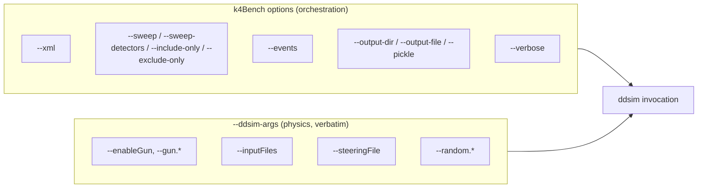
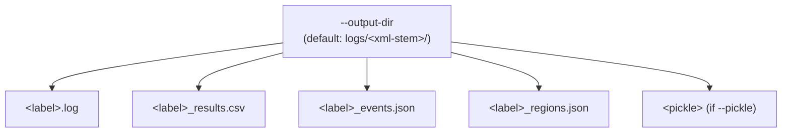

# Configuration

k4Bench is configured entirely through CLI flags (or, equivalently, a
[`BenchmarkConfig`](../reference/api/benchmark/ddsim.md) when used as a library).
There is no config file for the tool itself — the YAML files under
`.github/benchmarks/` configure the *nightly CI*, not the CLI, and are covered
in [File formats → benchmark YAML](../reference/file-formats.md#benchmark-yaml).

This page explains how the options interact. For a flat table of every option
with types and defaults, see the
[Configuration reference](../reference/configuration-reference.md).

## The two halves of a command

Every invocation splits cleanly into two concerns:



This separation is a deliberate design choice: the executor owns
*instrumentation* (timing, logging, metrics) and knows about
only three ddsim flags — `--compactFile`, `--numberOfEvents`, `--outputFile` —
which it injects itself. Everything else is your concern and flows through
`--ddsim-args`.

## `--ddsim-args` passthrough rules

`--ddsim-args` takes a **single shell-quoted string** that k4Bench splits with
`shlex` and forwards to `ddsim` unchanged.

```bash
--ddsim-args="--enableGun --gun.particle e- --gun.distribution uniform"
```

Rules and gotchas:

- **Always use the `=` form.** `--ddsim-args="..."` — never a space — or
  `argparse` mistakes the inner `--flags` for k4bench flags.
- **It is passed verbatim.** k4Bench does not validate it; an unknown ddsim flag
  fails inside `ddsim`, surfacing as a non-zero return code.
- **Don't set the managed flags.** Passing `--compactFile`,
  `--numberOfEvents`, or `--outputFile` here collides with what k4Bench injects.
  Use `--xml`, `--events`, and `--output-file` instead.
- **Quote values containing shell metacharacters**, e.g. `--gun.energy '10*GeV'`
  so the `*` is not glob-expanded.

!!! note "No `--inputFiles` flag"
    k4Bench has no dedicated flag for HepMC inputs. Pass them through
    `--ddsim-args="--inputFiles /path/to/events.hepmc"`. This is intentional:
    inputs are physics configuration, not orchestration.

## Sweep selection (mutually exclusive)

`--sweep`, `--sweep-detectors`, `--include-only`, and `--exclude-only` form a
mutually exclusive group. With none of them, you get a single baseline run. Their
exact semantics are in [Sweep modes](features/sweep-modes.md); the CLI maps the
flags onto a `SweepMode` as follows:

| Flags present | Resulting mode |
| --- | --- |
| *(none)* | `BASELINE` |
| `--sweep` | `FULL` |
| `--sweep-detectors A B` | `FULL` (removal set restricted to `A B`) |
| `--include-only A B` | `INCLUDE_ONLY` |
| `--exclude-only A B` | `EXCLUDE_ONLY` |

## Output layout



- **`--output-dir DIR`** — where logs/results go. If omitted, defaults to
  `logs/<xml-stem>/` (so `ALLEGRO_o1_v03.xml` → `logs/ALLEGRO_o1_v03/`). The
  directory is created if absent.
- **`--output-file PATH`** — the temporary EDM4hep ROOT file ddsim writes
  (default `/tmp/k4bench_out.edm4hep.root`). It is **reused and overwritten**
  across runs; only its size is recorded. It is *not* a result you keep.
- **`--pickle FILENAME`** — additionally serialise the full `list[RunResult]`
  to `<output-dir>/<FILENAME>` for later programmatic reload.

!!! warning "The output ROOT file is throwaway"
    Because `--output-file` is overwritten every run, you cannot inspect the
    physics output of individual sweep runs afterwards. k4Bench only cares about
    its *size*. If you need the actual EDM4hep events, run `ddsim` directly.

## Event count

`--events N` (default `2`) controls events per run. It is injected as
`--numberOfEvents` and used to compute `events_per_sec`. Implications:

- The tiny default makes `k4bench --xml ...` a fast smoke test.
- For meaningful timing, use enough events to amortise startup — 100–1000 is
  typical. The **first event is slower** (caches cold); analysis tools treat
  event 0 as a warmup and exclude it (see
  [Analysis](features/analysis.md#warmup-events)).

## Verbosity

`--verbose` / `-v` streams `ddsim` stdout to your terminal live. Without it, the
output is still captured to the `.log` file in full; only the live echo is
suppressed. Use it to watch a long run or debug a failing configuration.

## Library-only options

Two `BenchmarkConfig` fields have no CLI flag:

- **`setup_script`** — a shell script sourced before each `ddsim` invocation.
  Available only when driving k4Bench as a library.

!!! note "`setup_script` is not exposed on the CLI"
    As of this writing there is no `--setup-script` flag; the field exists in
    [`BenchmarkConfig`](../reference/api/benchmark/ddsim.md) and is honoured by
    the [executor](../reference/api/runner/executor.md), but only library callers
    can set it.

## Validation

Some invalid combinations are caught early, before any `ddsim` runs:

- `INCLUDE_ONLY` with an empty detector list → `ValueError` in
  `BenchmarkConfig.__post_init__`.
- Duplicate detector names → a `warnings.warn`, then de-duplicated.
- Unknown detector names → warned and skipped; if *all* are unknown, a
  `ValueError` listing the available detectors.
- Mutually exclusive sweep flags → `argparse` error at parse time.

These surface as `Error: ...` on stderr with exit code `1`. See
[Commands → exit codes](commands.md#exit-codes).
