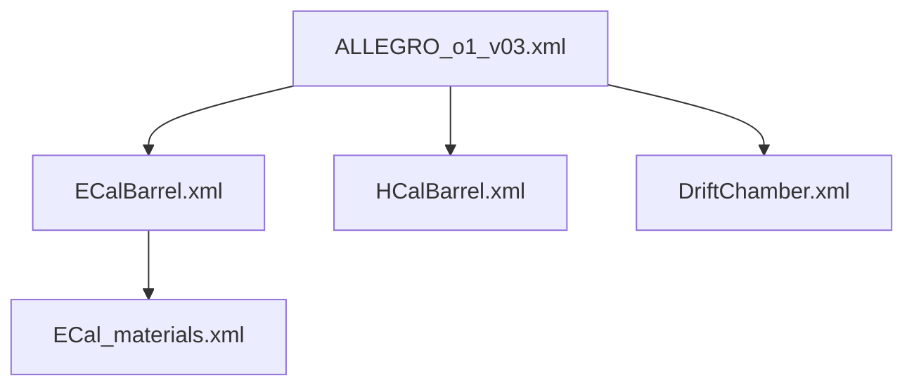

# Geometry patching

Geometry patching is the trick that lets k4Bench add or remove detectors
without ever touching the original XML. It lives in
[`k4bench.geometry.patcher`](../../reference/api/geometry/patcher.md) and
[`k4bench.geometry.scanner`](../../reference/api/geometry/scanner.md).

## Purpose

DD4hep geometries are split across many XML files linked by
`<include ref="..."/>` tags, and they usually live on a **read-only CVMFS
mount**. To benchmark "the geometry minus detector X" you need a modified
geometry — but you cannot edit the originals, and naïvely copying just one file
breaks the include graph. The patcher solves this by producing a self-consistent
set of *temporary* XML files with the requested detectors removed, and handing
`ddsim` a patched top-level file that transparently points at them.

## How it works

### Step 1 — Resolve the include tree

[`resolve_includes`](../../reference/api/geometry/scanner.md) walks
`<include ref="...">` recursively from the top-level XML, returning every
reachable file in encounter order (deduplicated, top-level first).



Two refs are skipped on purpose:

- Refs containing `$` (e.g. `${DD4hepINSTALL}/...`) — `ddsim` resolves those at
  runtime via its own search path, so k4Bench leaves them alone.
- Refs to files that don't exist on disk — warned and skipped.

[`get_detector_names`](../../reference/api/geometry/scanner.md) then collects
every `<detector name="...">` across the tree.

### Step 2 — Remove the detector node(s)

For **single removal** (`FULL` sweep), the patcher finds the one file that owns
the `<detector>` element, removes that node, and remembers the owning file.

For **keep-only / exclude** modes, it parses every reachable file and removes
all `<detector>` elements whose `name` is not in the keep set.

### Step 3 — Remove orphaned plugins

DD4hep `<plugin>` elements often reference a detector by name in an
`<argument value="...">`. When a detector is removed, its plugins would dangle,
so the patcher deletes any `<plugin>` whose argument values name a removed
detector.

!!! warning "Plugin removal is heuristic"
    This relies on the DD4hep convention that detector identity is encoded in
    argument `value` attributes. Plugins that reference detectors *differently*
    (other attributes, child elements) are **not** caught and may survive,
    potentially causing a ddsim error. If a sweep run fails only for one
    detector with a plugin-related message, this is the first thing to check.

### Step 4 — Absolutize file references

Because the patched files land in a temp directory (not next to the originals),
all *relative* file references must become absolute or ddsim can't find them.
The patcher rewrites `ref="..."` to absolute paths — but **only** on
`<include>`, `<gdmlFile>`, and `<file>` elements, the three DD4hep element types
whose `ref` is guaranteed to be a filesystem path. Other elements (e.g.
`<detector ref="...">`, where `ref` is a logical name) are left untouched. Refs
with `$` or already-absolute paths are skipped.

### Step 5 — Redirect includes (the fixpoint)

This is the subtle part. In keep-only mode, a file may be patched while another,
*unmodified* file still `<include>`s the original. The patcher iterates to a
fixpoint: any file whose include points at a now-patched file gets its own
redirected temp copy, until no more redirects are needed. This handles nested
chains like `top → A → B` where only `B` was patched — `A` must be rewritten to
reference `B`'s temp copy so ddsim sees the patched subtree.

A guard aborts with a clear error if the loop doesn't converge (a cycle in the
include graph).

### Step 6 — Write the patched top-level XML

Finally a patched top-level file is written whose `<include>` refs point at the
temp sub-files. This is the path handed to `ddsim` via `--compactFile`.

## Inputs

- The original top-level compact XML path.
- A detector name (single removal) or a set of names to keep.

## Outputs

Temporary XML files in the system temp directory, all prefixed with
**`_k4bench_tmp_`** for easy identification and cleanup:

| Prefix | Written by | Contents |
| --- | --- | --- |
| `_k4bench_tmp_no_<det>_sub_` | single removal | the owning file with the detector gone |
| `_k4bench_tmp_no_<det>_top_` | single removal | patched top-level |
| `_k4bench_tmp_keep_only_sub_` | keep-only | each patched/redirected sub-file |
| `_k4bench_tmp_keep_only_top_` | keep-only | patched top-level |

## The context managers (use these)

You almost never call the builders directly. Two context managers guarantee
cleanup even on exception:

```python
from pathlib import Path
from k4bench.geometry.patcher import patched_geometry, patched_geometry_keep_only

# Remove a single detector
with patched_geometry(Path("ALLEGRO_o1_v03.xml"), "ECalBarrel") as tmp_xml:
    ...  # tmp_xml is the patched top-level; run ddsim against it

# Keep only a subset
with patched_geometry_keep_only(Path("ALLEGRO_o1_v03.xml"), {"Vertex", "DriftChamber"}) as tmp_xml:
    ...
```

On exit (normal or exceptional) all temp files are unlinked.

## Failure modes

| Symptom | Cause | What to do |
| --- | --- | --- |
| `DetectorNotFoundError` | the name isn't a `<detector name>` in any reachable file | check spelling; list names with `get_detector_names` |
| `Could not absolutize ref '...'` warning | a relative ref points at a missing file | usually benign (e.g. a generated file); verify the geometry is complete |
| `Include-graph fixpoint loop did not converge` | a cycle in the include graph | the geometry has circular includes — not a k4Bench bug |
| ddsim fails only for one swept detector | an orphaned plugin survived removal | inspect that detector's `<plugin>` definitions (see the warning above) |

## See also

- [Sweep modes](sweep-modes.md) — which patching path each mode uses.
- [`geometry.scanner`](../../reference/api/geometry/scanner.md) /
  [`geometry.patcher`](../../reference/api/geometry/patcher.md) — full API.
