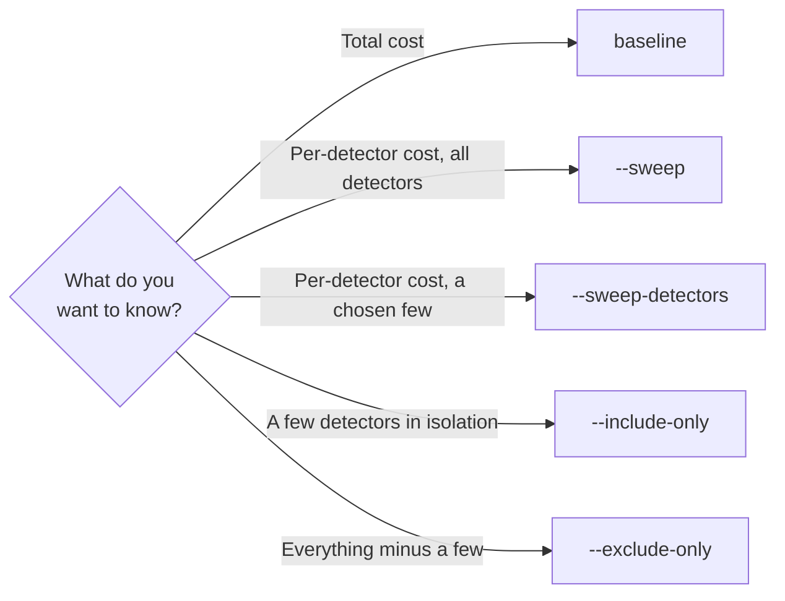

# Sweep modes

Sweep modes decide *which* geometry configurations get benchmarked, selected by
CLI flag (or by the `SweepMode` enum when using the library).

| Mode | CLI | Runs | What it does |
| --- | --- | --- | --- |
| Baseline | *(no flag)* | 1 | Time the full, unmodified geometry once. |
| Full | `--sweep` | 1 + N | Baseline, then one run per subdetector with that detector removed. |
| Partial | `--sweep-detectors A B …` | 1 + k | Like `--sweep`, but restricted to the named detectors (baseline + one run per name removed). |
| Include-only | `--include-only A B …` | 1 | Keep only the named detectors; remove all others. No baseline. |
| Exclude-only | `--exclude-only A B …` | 1 | Remove the named detectors; keep all others. No baseline. |

The four flags are mutually exclusive. To attribute cost to detectors you
compare runs that differ only in which detectors are present — each mode is a
different way to set that up. The patching that removes detectors safely is
covered in [Geometry patching](geometry-patching.md).



## Baseline

Time the complete geometry once — the reference point for everything else, and
the right choice when you only want overall numbers. `ddsim` runs against your
original XML directly, with no patching. Labelled `baseline_all`.

```bash
k4bench --xml ALLEGRO_o1_v03.xml --events 100 \
        --ddsim-args="--enableGun --gun.particle e-"
```

## Full sweep

Measure each subdetector's individual cost in one command: the baseline plus one
`without_<Name>` run per discovered detector.

```bash
k4bench --xml ALLEGRO_o1_v03.xml --sweep --events 500 \
        --ddsim-args="--enableGun --gun.particle e- --gun.distribution uniform"
```

The sweep is resilient: a detector that can't be patched is skipped (or logged
with a traceback) and the sweep continues to completion. A geometry with no
detectors yields just the baseline.

!!! note "Ablation is an estimate, not a clean decomposition"
    Removing a detector removes its material too, so showers develop differently
    and the per-detector deltas don't sum exactly to the baseline. For an
    intrinsic per-detector view, use the
    [region timing plugin](timing-plugins.md#per-region-timing).

## Partial sweep

A full sweep over a large detector can be dozens of runs. When you only care
about a handful of subdetectors, `--sweep-detectors` runs the same baseline plus
`without_<Name>` comparison but restricted to the names you list:

```bash
k4bench --xml IDEA_o1_v03.xml --sweep-detectors DCH VertexBarrel --events 500 \
        --ddsim-args="--enableGun --gun.particle e- --gun.distribution uniform"
```

This is exactly `--sweep` with the removal set narrowed — same `SweepMode.FULL`,
same `baseline_all` + `without_<Name>` labels, same resilience to unpatchable
detectors. Names not present in the geometry are warned and dropped; if *all*
requested names are unknown the run aborts and lists the available detectors.
It's the mode to reach for in CI when a full sweep would take too long.

## Include-only / exclude-only

Two single-run modes for studying a subset:

```bash
# Keep only these detectors → label only_ECalBarrel_HCalBarrel
k4bench --xml ALLEGRO_o1_v03.xml --include-only ECalBarrel HCalBarrel \
        --ddsim-args="--enableGun --gun.particle e-"

# Remove these, keep the rest → label without_DRcaloTubes
k4bench --xml ALLEGRO_o1_v03.xml --exclude-only DRcaloTubes \
        --ddsim-args="--enableGun --gun.particle e-"
```

Names not present in the geometry are warned and dropped; if *all* requested
names are unknown the run aborts and lists the available detectors. An empty
include list is rejected; an empty exclude list falls back to a baseline run.

## Run labels

Labels double as filename stems, so they're kept short:

| Mode | Label |
| --- | --- |
| Baseline / full baseline | `baseline_all` |
| Full removal | `without_<Name>` |
| Include-only | `only_<a>_<b>_…` |
| Exclude-only | `without_<a>_<b>_…` |
| More than five names | `<prefix><N>_detectors_<hash>` |

When many detectors are named the label collapses to a stable hash so filenames
stay sane; the full list is printed to the run's log.

## See also

- [Geometry patching](geometry-patching.md) — how detectors are removed safely.
- [Commands](../commands.md) — the flags in context.
- [Examples](../../examples/common-workflows.md) — more scenarios.
