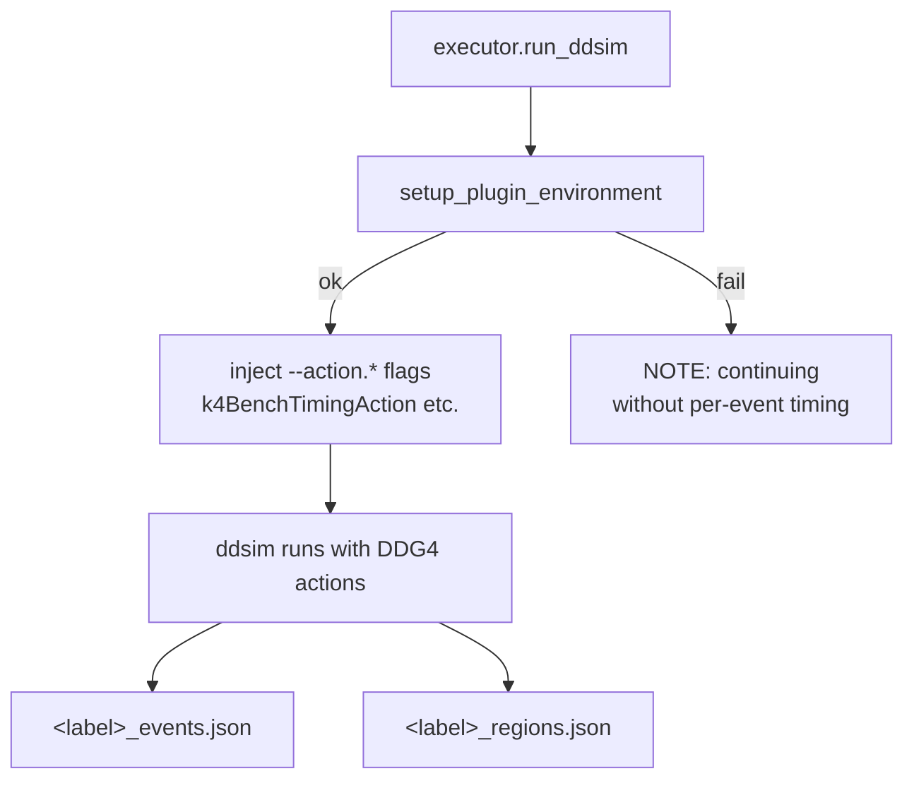

# Timing plugins

The run-level metrics (wall time, RSS) come from `/usr/bin/time -v` and need
nothing extra. For a finer view — *per event* and *per subdetector* — k4Bench
ships two optional C++ DDG4 plugins that instrument Geant4 from the inside.

They live in `plugin/` (`k4BenchTimingAction.cpp`,
`k4BenchRegionTimingAction.cpp`) and are wired up by
[`k4bench.plugin.runtime`](../../reference/api/plugin/runtime.md) and
[`k4bench.runner.executor`](../../reference/api/runner/executor.md).

## Purpose

`time -v` measures the whole `ddsim` process, including geometry building and
Geant4 initialisation. That's useful but coarse. The plugins answer two sharper
questions:

- **How long does each *event* take, and how does memory grow per event?**
  (the event plugin)
- **Which *subdetector* is the simulation spending its stepping time in?**
  (the region plugin)

## How they're loaded

You don't enable them by hand. Before each run, the executor calls
[`setup_plugin_environment`](../../reference/api/plugin/runtime.md), which:

1. Builds the plugins if needed
   ([`ensure_plugin_built`](../../reference/api/plugin/runtime.md) → `plugin/build.sh`).
2. Locates the directory containing both the `.so` files **and** the
   `.components` manifests DDG4 needs to resolve factory names
   ([`find_plugin_lib_dir`](../../reference/api/plugin/runtime.md)).
3. Prepends that directory to `LD_LIBRARY_PATH`.
4. Sets `K4BENCH_EVENT_JSON` (and `K4BENCH_REGION_JSON`) to the per-run output
   paths.

If any of this fails, it prints `NOTE: k4Bench timing plugins unavailable
(...); continuing without per-event timing` and returns `False` — the run
proceeds with run-level metrics only. **Plugins are best-effort, never fatal.**

When available, the executor appends DDG4 action flags automatically — unless
you already supplied the corresponding `--action.*` flag in `--ddsim-args`, in
which case yours wins:

- `--action.event k4BenchTimingAction` — the event plugin
- `--action.step k4BenchRegionTimingAction`,
  `--action.track k4BenchRegionTrackingAction`,
  `--action.event k4BenchRegionEventAction` — the region plugin's three actions

!!! note "Three actions, one library"
    The region plugin bundles stepping, tracking, and event actions into a
    single `libk4BenchRegionTimingAction.so`. DDG4 can only resolve the extra
    factory names via the `.components` manifest, which is why
    `find_plugin_lib_dir` insists on finding it next to the `.so`.

## Per-event timing (`k4BenchTimingAction`)

### What it measures
For every event: wall time (monotonic `steady_clock`) and RSS sampled from
`/proc/self/status` before and after the event.

### Output → `<label>_events.json`
Parallel arrays: `event_numbers`, `event_times_s`, `event_rss_begin_mb`,
`event_rss_end_mb`. Loaded by
[`load_event_timing`](../../reference/api/analysis/loader.md) into a DataFrame
with an added `rss_delta_mb` column. Schema:
[File formats → events.json](../../reference/file-formats.md#events-json).

### Output path
`K4BENCH_EVENT_JSON` (set per run). Defaults to `k4bench_events.json` in the CWD
if the variable is unset.

!!! warning "Single-threaded only"
    The event plugin assumes sequential event processing; its internal vectors
    are **not** protected for multithreaded Geant4. k4Bench runs ddsim
    single-threaded, so this is fine in normal use — but don't reuse the plugin
    in an MT setup.

## Per-region timing (`k4BenchRegionTimingAction`) { #per-region-timing }

This is the more sophisticated plugin. It attributes Geant4 stepping time to the
**top-level DD4hep `DetElement`** a step occurs in — the same notion of
"subdetector" the sweep uses — rather than to Geant4 `G4Region`s.

!!! info "Why DetElement, not G4Region?"
    In many production geometries (e.g. ALLEGRO `o1_v03`) only a subset of
    detectors define explicit regions, so a region-based view dumps almost all
    the time into `DefaultRegionForTheWorld`. Attributing by DD4hep DetElement
    gives a meaningful per-detector breakdown for any geometry.

### Two attribution views

The plugin records the same time under two complementary charging schemes:

`at_location`
:   Time charged to the detector the step is **physically in** right now.

`by_birth`
:   Time charged to the detector where the track was **created**. Secondaries
    inherit their parent's birth detector, so shower secondaries born inside
    `ECalBarrel` are attributed to `ECalBarrel` even as they cross into
    neighbours. Primaries born in vacuum (e.g. the interaction point) fall into
    `unattributed`.

The gap between the two is informative: it separates a detector's *intrinsic*
cost (born and tracked there) from *imported* cost (born there, tracked
downstream). Steps outside any DetElement (vacuum transport, un-modelled
beampipe) are bucketed as `unattributed`.

### Timer

On x86_64 the plugin uses `rdtscp` (built with `-DK4BENCH_X86_64=1`, set in
`CMakeLists.txt`); elsewhere it falls back to `steady_clock`. It measures and
reports its own per-step timer overhead (`per_step_timer_overhead_ns`) so you
can judge how much of the attribution is measurement cost.

### Output → `<label>_regions.json`
A richer schema (`schema_version: 1`) with per-event arrays
(`event_wall_seconds`, `event_region_sum_seconds`, `event_unaccounted_seconds`),
per-detector time matrices (`at_location_seconds`, `by_birth_seconds`),
`interval_counts` (timer intervals per detector, ~step counts), and metadata
(`indexed_top_level_detectors`, `indexed_top_level_detector_lv_counts`, `timer`).
Loaded by [`load_region_timing`](../../reference/api/analysis/loader.md). Full
schema: [File formats → regions.json](../../reference/file-formats.md#regions-json).

### Output path
`K4BENCH_REGION_JSON`. If unset (and the action still activates via a steering
script), it defaults to `k4bench_regions.json` in the CWD.

## Using your own actions

If you pass `--action.event SomeAction` in `--ddsim-args`, the executor detects
it and does **not** inject the corresponding k4Bench action — your configuration
wins. This lets you combine k4Bench with custom DDG4 actions or steering files.

## Failure modes

| Symptom | Likely cause | Fix |
| --- | --- | --- |
| `NOTE: ... continuing without per-event timing` | plugins not built / not found | run `bash plugin/build.sh` in the Key4hep env; check `LD_LIBRARY_PATH` |
| No `_regions.json` written | region action never activated (e.g. a steering file overrode actions) | ensure your steering file doesn't replace the action list |
| Region times look dominated by `unattributed` | many steps in vacuum/world, or geometry lacks DetElements | expected for some geometries; compare `at_location` vs `by_birth` |
| Build fails | DD4hep/DDG4 headers not on the include path | source the Key4hep environment before building |

## See also

- [Analysis](analysis.md) — loading and plotting the JSON outputs.
- [`plugin.runtime`](../../reference/api/plugin/runtime.md) — discovery/build logic.
