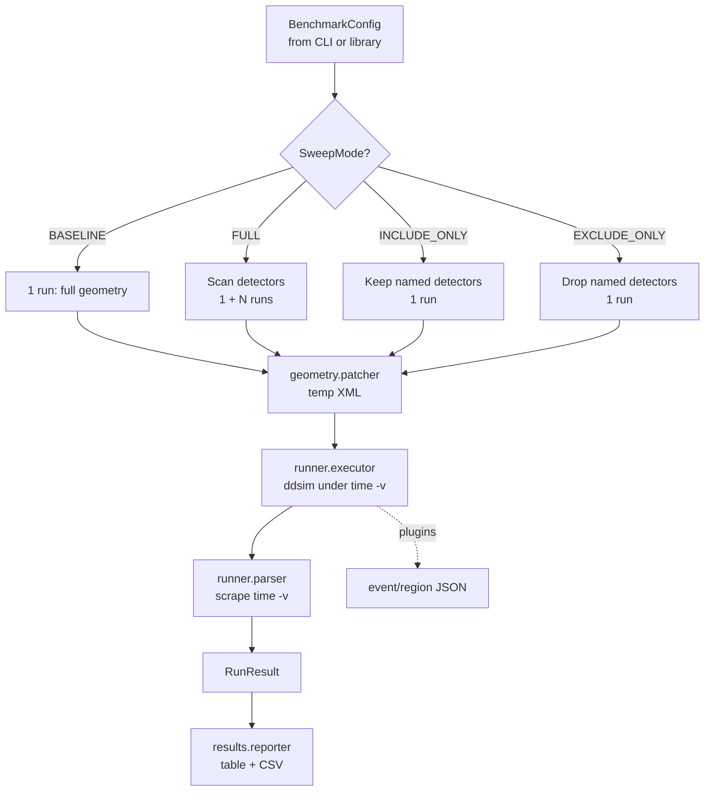
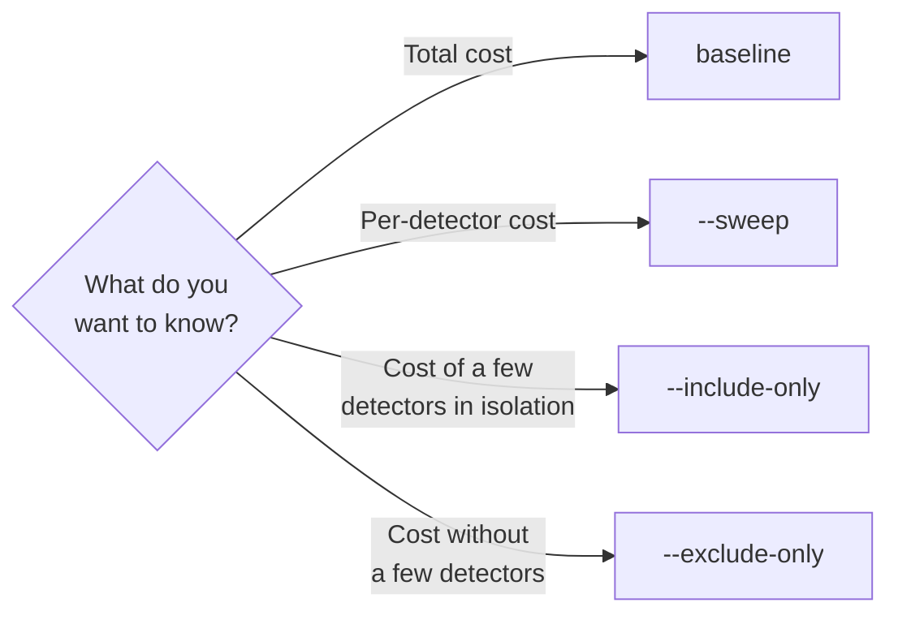

# Overview

This page builds the mental model you need to use k4Bench effectively: the
vocabulary, the pipeline, and the decisions you'll make. It's the hub for the
rest of the user guide.

## The core idea

k4Bench treats a detector simulation as a black box with measurable cost, and
gives you a controlled way to vary *one thing* — the geometry — while holding
everything else fixed. By comparing a **baseline** (full geometry) against runs
with detectors added or removed, you attribute cost to detectors.

Crucially, it does this **non-destructively**. The geometry XML you point at —
often on a read-only CVMFS mount — is never edited. Instead, k4Bench parses the
include tree, produces *patched copies in a temp directory*, and runs `ddsim`
against those.

## The pipeline



Each stage maps to a Python module, documented under
[Architecture](../architecture/overview.md) and in the
[API reference](../reference/api-reference.md).

## Vocabulary

A handful of terms recur throughout the docs. The full list is in the
[Glossary](../glossary.md); these are the essentials:

Baseline
:   A run with the **full, unmodified geometry**. Always labelled
    `baseline_all`. Every other run is interpreted relative to it.

Sweep
:   A *set* of runs that vary the geometry — typically the baseline plus one
    run per detector removed. Selected with `--sweep`.

Subdetector / detector
:   A `<detector name="...">` element in the DD4hep compact XML. k4Bench
    discovers these by walking the `<include>` tree. This is also the unit of
    attribution for the region timing plugin (a top-level DD4hep `DetElement`).

Run label
:   A short identifier for one run, used as the log/CSV filename stem and in the
    summary table — e.g. `baseline_all`, `without_ECalBarrel`,
    `only_Vertex_DriftChamber`.

ddsim args
:   Everything physics-related, passed verbatim to `ddsim` via `--ddsim-args`.
    k4Bench is deliberately agnostic about it.

## Choosing a sweep mode

k4Bench has four strategies. Pick based on the question you're asking:

| You want to… | Mode | Flag |
| --- | --- | --- |
| Just time the full geometry once | Baseline | *(none)* |
| Measure every detector's individual cost | Full sweep | `--sweep` |
| Measure cost of a specific subset only | Include-only | `--include-only A B` |
| Measure the geometry minus a few detectors | Exclude-only | `--exclude-only A B` |

Full semantics, including edge cases (unknown detector names, empty sets), are
in [Sweep modes](features/sweep-modes.md).



## What you get back

Every run produces, at minimum:

- A row in the **summary table** printed to stdout.
- A **`<label>_results.csv`** with all run-level metrics.
- A **`<label>.log`** with the complete `ddsim` output (including the raw
  `time -v` block).

If the optional C++ timing plugins are present, you additionally get:

- **`<label>_events.json`** — per-event wall time and RSS.
- **`<label>_regions.json`** — per-subdetector Geant4 stepping time, in two
  attribution views.

These feed the [analysis layer](features/analysis.md) and the
[dashboard](features/dashboard.md). Schemas live in
[File formats](../reference/file-formats.md).

## Two ways to drive it

=== "Command line"

    The `k4bench` console script is the primary interface. See
    [Commands](commands.md).

    ```bash
    k4bench --xml geom.xml --sweep --ddsim-args="--enableGun --gun.particle e-"
    ```

=== "Python library"

    Build a [`BenchmarkConfig`](../reference/api/benchmark/ddsim.md) and call
    `run_sweep` directly — useful for scripting parameter scans.

    ```python
    from pathlib import Path
    from k4bench.benchmark.ddsim import BenchmarkConfig, SweepMode, run_sweep

    config = BenchmarkConfig(
        xml_path=Path("geom.xml"),
        n_events=100,
        output_file=Path("/tmp/out.edm4hep.root"),
        log_dir=Path("logs/geom"),
        mode=SweepMode.FULL,
        extra_args=["--enableGun", "--gun.particle", "e-"],
    )
    results = run_sweep(config)   # list[RunResult]
    ```

## Where to go next

- [Configuration](configuration.md) — how options interact, output layout.
- [Commands](commands.md) — every flag with realistic examples.
- Feature deep-dives: [Sweep modes](features/sweep-modes.md) ·
  [Geometry patching](features/geometry-patching.md) ·
  [Timing plugins](features/timing-plugins.md) ·
  [Analysis](features/analysis.md) · [Dashboard](features/dashboard.md)
